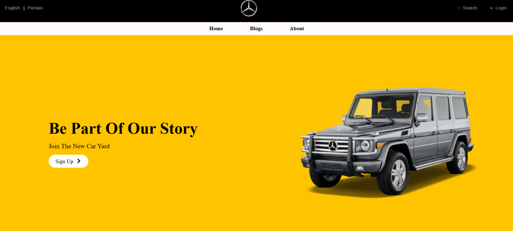

# 🚗 Car Online Shop 🛒

# Hey there, friend! 👋

Welcome to a cutting-edge project built using modern technologies and design principles. This project is inspired by some of the best e-commerce websites and has been brought to life through my skills and passion for frontend development.

With the use of Vite, I’ve ensured high speed and a modern architecture, aiming to deliver an experience that is smooth, responsive, and user-friendly.

Feel free to explore the project, and I would love to hear your thoughts and feedback! If you're interested in collaborating or discussing this project, don't hesitate to get in touch. 😊

I hope you enjoy your experience with it! 🚀

🌟 **Live Demo**

🔗 [Check it out here](https://space-spa-project.netlify.app/)

### **Technologies Used:**

- 
- 
- 
- 
- 

### 📬 **Contact Me:**

If you'd like to reach out, here’s how you can connect with me:

